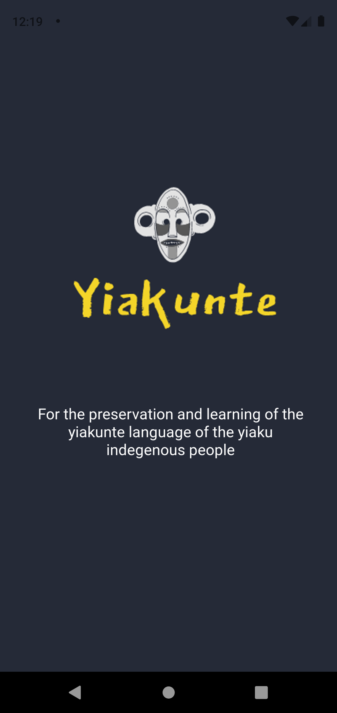
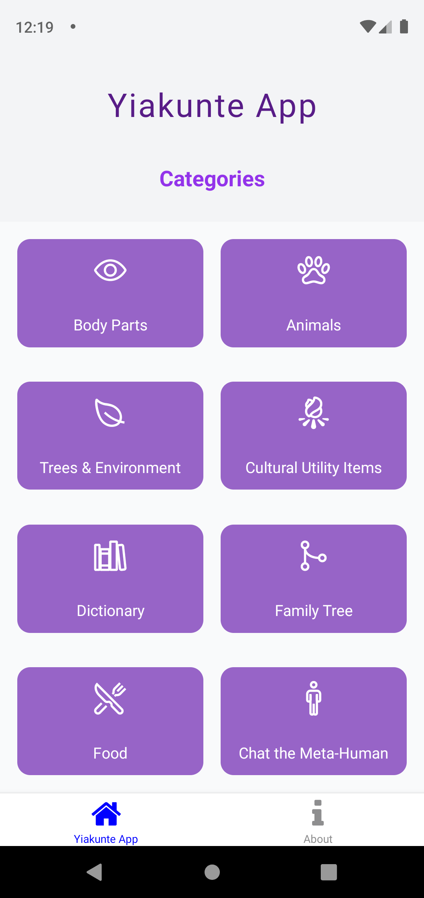

# Yiakunte

# Yiakunte Language Digitization Project

This project aims to digitize the Yiakunte language, which is listed by UNESCO as an endangered/almost extinct language. The project consists of a Django backend, a React frontend, and a React Native app.

## Features

- Digitize and preserve the Yiakunte language
- Django backend for managing language data
- React frontend for web-based language tools
- React Native app for mobile language learning

## Screenshots

## Installation

To run the project locally, follow these steps:

1. Clone the repository.
2. Set up the Django backend by following the instructions in the [PostGis Setup](`postgres_setup.md`) file.
3. Set up a production server by following the instructions in the [Server Setup](`server_setup.md`) file.
4. Set up the React Native app by following the instructions in the `NATIVE2` directory.

## Usage

- Access the web-based language tools by navigating to the frontend URL.
- Install the React Native app on your mobile device to learn Yiakunte on the go.

## Contributing

Contributions to the project are welcome! If you would like to contribute, please follow the guidelines outlined in the [Contributing Guidelines](`CONTRIBUTING.md`).

## License

This project is licensed under the [MIT License](LICENSE).

## Contact

